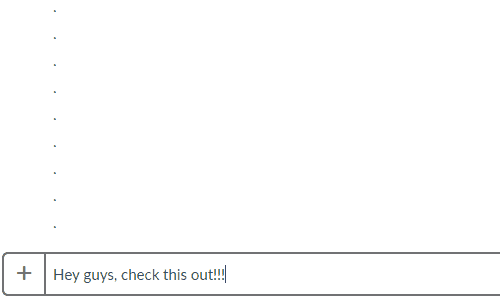

# EmojiCutter

Emoji Cutter lets you generate and use HUGE emojis on Slack. Application consists of a web front-end built with React, and a Node express back-end server.

## requirements

1. [Node + npm](https://nodejs.org/en/)

## Getting started

1. run `npm install` to install all dependencies
2. run `npm start` to run the server
3. navigate to `localhost:3000` to use the app
